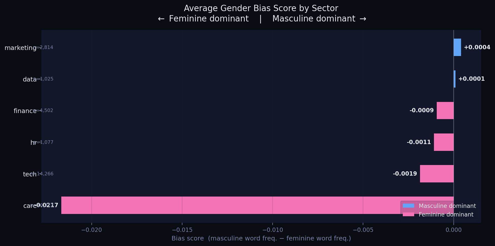

#  Gendered Language in Job Postings: A Data-Driven Audit

> *"Before an ATS screens your CV, the job posting already screened you.
> Biased language → fewer applications → biased training data → biased ATS.
> Here's where the loop begins."*

---

##  Why This Project?

In 2011, Gaucher et al. demonstrated that gendered wording in job advertisements exists and actively sustains gender inequality. Over a decade later — **does it still?**

This project audits **34,656 real job postings** across 6 sectors of the US job market, using NLP to measure how language encodes gender expectations. The findings challenge common assumptions: **tech is not the most masculine sector. Care is not just "feminine" — it's in a category of its own.**

Built as a portfolio project at the intersection of **data science, NLP, and social ethics** — areas where technical rigor meets human impact.

---

##  Key Findings

| Sector | Bias Score | Profile |
|---|---|---|
|  Care | -0.0217 | **Strongly feminine** — 86% of postings |
|  Tech | -0.0019 | Slightly feminine — 54% neutral |
|  Finance | -0.0009 | Slightly feminine |
|  HR | -0.0011 | Slightly feminine |
|  Marketing | +0.0004 | **Most masculine** — contrary to expectations |
|  Data | +0.0001 | Quasi-neutral |

**3 counterintuitive insights:**

1. **Tech is NOT the most masculine sector** — Marketing is. The characterization of marketing as a “male-dominated culture” may be overstated relative to the actual linguistic patterns observed in practice.
2. **Care is in a category of its own** — with 25.42 feminine words per 1,000 (vs. 7-9 for all other sectors), the healthcare sector doesn't just lean feminine — it encodes a gendered identity into its job ads.
3. **The Gaucher lexicon holds** — corpus analysis of 34k postings found no new behavioral gendered terms beyond the 2011 study, suggesting that biased language operates through a **stable, limited vocabulary** — the same words, decade after decade.

---

## Methodology

```
Raw Data → Cleaning → Sector Mapping → Lexicon Construction → Scoring → Visualization
```

### 1. Data Collection
- **Source**: LinkedIn Job Postings dataset (Kaggle, ~124k postings)
- **Filtered**: US market, 6 sectors, descriptions > 200 characters
- **Final dataset**: 34,656 job postings

### 2. Lexicon Construction
- **Base**: Gaucher et al. (2011) — 15 masculine-coded + 15 feminine-coded words
- **Extended**: manual review of 35 masculine + 35 feminine terms
- **Corpus validation**: frequency analysis confirmed no additional behavioral gendered terms in 2023-2024 data

### 3. Scoring
For each job posting:
```python
bias_score = (masculine_word_frequency) - (feminine_word_frequency)
# Positive = masculine dominant
# Negative = feminine dominant
# |score| < 0.005 = neutral
```

### 4. Analysis
- Per-sector bias score distribution
- Classification: masculine / neutral / feminine per posting
- Word density analysis (occurrences per 1,000 words)

---

## Dataset

| Field | Value |
|---|---|
| Source | [LinkedIn Job Postings — Kaggle](https://www.kaggle.com/datasets/arshkon/linkedin-job-postings) |
| Size | 34,656 postings (filtered from 123,849) |
| Sectors | tech, care, finance, marketing, hr, data |
| Market | United States |
| Period | 2023–2024 |

---

##  Project Structure

```
gendered-job-language/
│
├── data/
│   ├── raw/                  # original dataset
│   ├── processed/            # cleaned & scored data
│   └── lexicon/              # gendered_lexicon.json
│
├── notebooks/
│   ├── 01_collection.ipynb   # data loading & cleaning
│   ├── 02_lexicon.ipynb      # lexicon construction
│   ├── 03_analysis.ipynb     # bias scoring & stats
│   └── 04_visualization.ipynb
│
├── src/
│   ├── cleaner.py
│   └── analyzer.py
│
└── README.md
```

---

##  How to Run

```bash
# Clone the repo
git clone https://github.com/yourusername/gendered-job-language
cd gendered-job-language

# Create virtual environment
python -m venv venv
source venv/bin/activate  # Windows: venv\Scripts\activate

# Install dependencies
pip install -r requirements.txt

# Download data
# → Place job_postings.csv in data/raw/
# → Source: https://www.kaggle.com/datasets/arshkon/linkedin-job-postings

# Run notebooks in order
jupyter notebook notebooks/
```

---

##  References

- Gaucher, D., Friesen, J., & Kay, A. C. (2011). *Evidence That Gendered Wording in Job Advertisements Exists and Sustains Gender Inequality.* Journal of Personality and Social Psychology, 101(1), 109–128.
- Bolukbasi, T., et al. (2016). *Man is to Computer Programmer as Woman is to Homemaker? Debiasing Word Embeddings.*
- LinkedIn Job Postings Dataset — Kaggle (2024)

---

## 🔮 Next Steps

- [ ] **BERT-based classifier** : moving beyond keyword matching to contextual understanding
- [ ] **Temporal analysis** : tracking language evolution year over year
- [ ] **Salary correlation** : do masculine-coded postings offer higher compensation?
- [ ] **Interactive dashboard** : Streamlit app for real-time posting analysis

---

## About

Built by **Abir** — Data Science engineering student

---

<p align="center">
  
  <br><em>Average gender bias score by sector — care stands in a category of its own</em>
</p>
